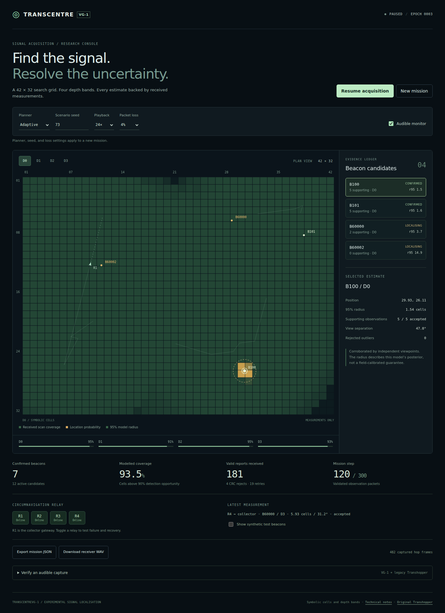

# TranscentreVG-1

The next generation of **Transhopper**, focused on beacon acquisition and localisation. Four simulated relay machines search a **42 × 32 flat grid** across four symbolic depth bands. Received range and bearing measurements build a probability map; the planner seeks observations that resolve uncertainty and provide independent confirmation.



[Watch the TranscentreVG-1 MP4](media/TranscentreVG-1.mp4) — a 60-second, 1080p demonstration with audible packets from the actual VG-1 engine.

## Run

Requires Node.js 20 or newer. No package installation or external browser dependencies are needed.

```sh
npm start
```

Open <http://localhost:8000> and select **Run acquisition**. Use the depth tabs and candidate ledger to inspect each estimate. Planner, seed, and packet-loss changes take effect with **New mission**. The audible monitor starts after a user gesture; its checkbox mutes playback.

## Acquisition improvements

- **Evidence-based positions:** a Bayesian posterior over 1,344 cells for each beacon, with range/bearing uncertainty and a clutter likelihood.
- **Stronger confirmation:** at least five agreeing observations, three effective observations after repeated-view discounting, two receivers, 25° view separation, and a model radius no greater than 2.5 cells.
- **Outlier resistance:** inconsistent reports are gated; repeated observations from the same receiver position have diminishing influence. Conflicting evidence can withdraw confirmation.
- **Purposeful revisits:** the planner balances estimated information gain, missing witnesses, viewpoint geometry, travel, evidence consistency, and exploration. Supported candidates remain eligible across receiver rotations.
- **Measured delivery:** CRC checks, epoch and duplicate rejection, hop limits, bounded retries, and alternate ring routing determine which reports reach the estimator. An offline gateway cannot produce coverage or discoveries.

Target positions are never passed to the tracker or planner. The optional test-beacon overlay and exported evaluation use synthetic truth separately.

## Measured results

Both planners below use the VG-1 tracker. These are **12 held-out synthetic scenarios**, each containing eight static beacons and running for 300 steps, with 8% measurement outliers, 4% per-hop packet loss, and 1% frame corruption.

| Metric | Coverage baseline | Adaptive VG-1 |
| --- | ---: | ---: |
| Beacons confirmed | 96 / 96 | 96 / 96 |
| False beacons ever confirmed | 0 | 0 |
| Median first confirmation, including delivery | 81.5 steps | **74.5 steps** |
| Median final position error | 0.418 cells | **0.397 cells** |
| 90th-percentile final position error | 0.733 cells | **0.709 cells** |
| Mean modelled coverage | **99.92%** | 98.86% |

The adaptive planner confirmed beacons sooner with slightly lower position error in this test set, while covering slightly less of the grid. Results are specific to this synthetic model. They do not establish universal discovery or field-calibrated accuracy. The development scenarios and every individual result are included in [docs/benchmark.json](docs/benchmark.json).

```sh
npm test
npm run benchmark
```

The tests cover localisation, independent confirmation, candidate retention, receiver outages, packet integrity, unknown audio timing, corrupted-frame rejection, and both generations of recordings. The benchmark reproduces the development and held-out cohorts.

## Audible records

**Download receiver WAV** exports captured hop frames as 1,200-bit/s binary FSK using 1,200 Hz and 2,200 Hz. **Verify an audible capture** finds packet timing and validates CRCs without a manifest. It accepts 48 kHz, 16-bit PCM WAV files, mono or stereo, and supports both VG-1 and original Transhopper packets.

Live audio samples delivered observation packets when playback outruns real-time audio. The WAV contains the latest 1,024 captured hop frames, including duplicates and corrupted frames; the interface reports omitted earlier frames. It is a serialised diagnostic capture, not a recording of simultaneous physical radio channels.

See [technical notes](docs/transcentrevg-1.md) for the estimator, planner, wire format, and assumptions, and [verification results](docs/verification.md) for release checks.

## Reproduce the VG-1 video

With Node.js, Python, FFmpeg, and the packages from `requirements.txt` installed:

```sh
python scripts/render_transcentre_video.py
```

The renderer runs the actual acquisition engine for 300 steps using seed 73, displays its measurements and estimates across all four bands, and encodes selected received packets as synchronised audible FSK. The presentation interpolates receiver motion between simulation steps. It writes `media/TranscentreVG-1.mp4` and a packet/evaluation manifest at `media/TranscentreVG-1-video.json`.

After encoding, it decodes the MP4's AAC soundtrack and checks that all 65 selected packets retain their bytes, CRC validity, and timing. Use `--work-dir PATH` to retain intermediate snapshots, WAV files, and review stills.

## Original Transhopper

The original demonstration remains at [legacy/transhopper.html](legacy/transhopper.html), with its [48-second video](media/Transhopper-42x32.mp4), [lossless audio](media/transhopper-audio.wav), and [protocol](docs/protocol.md).

To reproduce that media, use Python 3.10 or newer and FFmpeg:

```sh
python3 -m venv .venv
. .venv/bin/activate
python -m pip install -r requirements.txt
python scripts/build_transhopper.py
python scripts/render_transhopper.py
python scripts/verify_media.py
python scripts/verify_media.py --video
```

The renderer uses DejaVu Sans and DejaVu Sans Mono under `/usr/share/fonts/truetype/dejavu/` by default. Set `TRANSHOPPER_FONT` and `TRANSHOPPER_MONO_FONT` to installed font files on other systems.

## Model scope

Cells and depth bands have no assigned geographic distance or altitude. The moving receivers, beacon measurements, and relay failures are simulated. The estimator assumes static, identified beacons; it does not solve anonymous or moving-object association. The model does not include rotor noise, terrain, radio propagation, collision avoidance, or actual aircraft control. CRC detects accidental corruption and provides no sender authentication.

## License

TranscentreVG-1 uses the repository’s existing GNU Affero General Public License v3.0. See [LICENSE](LICENSE). The retained Transhopper files keep their Apache 2.0 notice and license; see [NOTICE.md](NOTICE.md) and [legacy/LICENSE](legacy/LICENSE).
